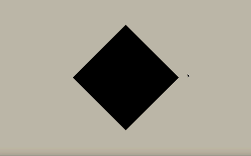
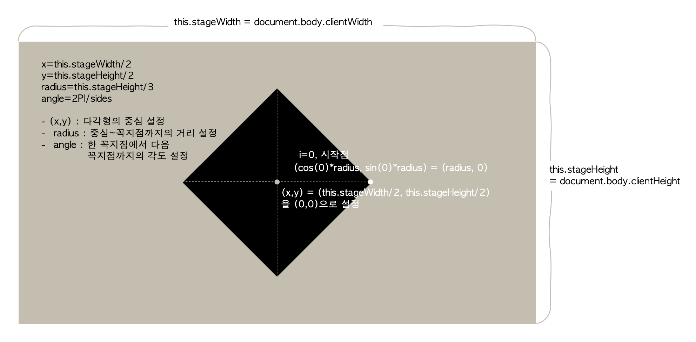

# rotating-shape

## 코드 공부 내용
https://sand-niece-09d.notion.site/rotating-shape-2f1175af2e6948f98ea9373b5b5250ed

## 코드 출처
### youtube 'Interactive Developer'
https://www.youtube.com/watch?v=urDcoyIc6VQ&list=PLGf_tBShGSDNGHhFBT4pKFRMpiBrZJXCm&index=9